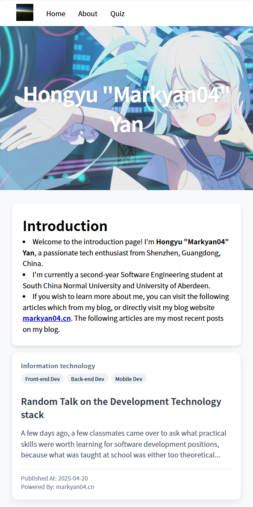

# Report of Assignment

## 1. Introduction and Project Structure
Foreword: If you need to test whether the function of my quiz module is normal, please use two browsers for the test. Because I have stored the user and competition information in `localStorage`, using the same browser client will cause the content of `localStorage` to be overwritten.
This Web application adopts the MVC software architecture. Its file structure, as well as the functions of each file and folder, are as follows:

```
WebAssignment/
├── bin/
│   └── www.js               	# Server startup entry
├── controllers/			 	# The controller layer of the back-end application
│   ├── matchingController.js
│   ├── quizController.js   	
│   └── socketController.js
├── data/						# The persistent storage layer of the back end application
│   └── question.json        	
├── model/						# The model layer of the back end application
│   ├── quizInfo.js           
│   └── userList.js           
├── public/						# Public resources
│   ├── images/        	       	# Picture resources
│   ├── javascripts/			# Front-end responsive page JS script		
│   │   ├── hall.js           
│   │   ├── quiz.js   
│   │   ├── login.js
│   │   ├── about.js         
│   │   ├── utils/				# Front-end JS tool classes      
│   │   └── socket/				# Front-end socket.io client JS script 
│   └── stylesheets/			# Style resource			
│       ├── hall/             	# Style of Matching Hall
│       ├── quiz/             	# Style of Quiz Page
│       ├── about/				# Style of About Page
│       ├── introduction/		# Style of Introduction Page
│       ├── login/				# Style of Login Page
│       ├── error.css			# Style of Error Page
│       ├── image.css			
│       ├── loading.css			
│       └── base.css 			# Basic Style of Front-end Application
├── routes/						# Routes Management of the back-end application
│   ├── hall.js               
│   ├── login.js              
│   ├── quiz.js 
│   ├── intro.js
│   └── about.js              
├── services/					# The service layer of the back-end application
│   ├── matchingService.js    
│   ├── quizService.js        
│   └── socketService.js      
├── views/						# The view layer of the front-end application
│   ├── hall.html             
│   ├── login.html    
│   ├── intro.html 
│   ├── quiz.html            
│   ├── about.html            
│   └── error.html            
├── app.js                    # Express application instance configuration
├── sockets.js                # Server configuration of socket.io
├── package.json              # Project Dependency Management
├── .gitignore          	  # The Management of git ignore files
└── .env                      # Environment variable configuration
```

## 2. Introduction Part

The Introduction page is a static page that briefly introduces some of my basic information and contact details. The article posts on this page are linked to the articles on my personal blog "markyan04.cn" (If you click the article, since my personal blog server is in China, its response speed may be relatively slow). Meanwhile, since my entire application is designed in a responsive manner, it can automatically adapt to the screen sizes of various devices. The page on the computer and mobile devices are shown in the following figure.

In PC with a high-resolution display, the UI is given as follows.


In PC with a low-resolution display, the UI is given as follows.


In mobile device, the UI is given as follows.



## 3. About Part

The "About" page mainly consists of two parts, briefly introducing my technical stack and project experiences. And provide jump connections for each project. Meanwhile, since my entire application adopts a responsive design, it can automatically adapt to the screen sizes of various devices.

In PC with a high-resolution display, the UI is given as follows.


In PC with a low-resolution display, the UI is given as follows.


In mobile device, the UI is given as follows.


## 4.Quiz Part

The Quiz Part is the most important part of this assignment. I have divided it into three sub-parts for development. In the following three chapters, I will introduce its implementation process in detail. By the way, All the following pages have also completed the responsive design. However, I don't think this is the focus of the Quiz part, so I won't take screenshots or introduce them specifically.

### 4.1 Login Page

The Login Page mainly handles the login logic of users. Users enter their usernames on this page and then click "Login" to enter the Matching Hall Page. 


If the server detects that the username has been occupied by other online users, the front end will prompt login failure and provide a button to return to the login page.


In fact, there are no interaction events between the socket server and the client on the Login page. The socket initialization connection is triggered when entering the Matching Hall Page. I will introduce these contents in detail in the next part.

### 4.2 Matching Hall Page

The Matching Hall Page has fully realized the entire matching process. When users enter the platform, they can see all the current online players and can click on any player to initiate a match. The matched players can choose to agree or reject.


When the two sides match successfully, "Matching Success" will be displayed and it will be automatically redirected to "Quiz Page" after 3 seconds.


The socket communication process of the current page is shown in the following figure:


### 4.3 Quiz Page

The Quiz Page is responsible for handling the logic of battles between users. When both users are linked to the server, they need to click the "Start" button to indicate that they are ready.


After both sides of the competition are ready, the competition will start and users can choose an answer and submit it.


After both sides have submitted, the server will return the Result to the client. The client can view the current competition situation in the Result section, including the total scores of both sides, the result of this question, and the score of this question.


After completing this question, the server will send the Next question only when both sides of the competition click "Ready for Next".

When the competition reaches the last question, after clicking "Ready for Next" on both sides, the competition result will be displayed.


This structure ensures that users on both sides can receive the questions simultaneously and will not receive the answers to the main topic or information about other questions in advance, guaranteeing the fairness of the competition.

Meanwhile, during the competition, if either side leaves the game, the other side will receive a message that the other side is offline. The competition will end early.


The socket communication process of the current page is shown in the following figure:


## 5. Challenges
During the development process, I encountered a rather troublesome problem. Since my Quiz section is not implemented with a single route and a single HTML. During the page jump process, the socket will disconnect. After reaching a new page, the socket will reconnect and generate a new socketId. This was not taken into consideration when I initially designed the software architecture.

This will cause A problem. When User A connects to the Quiz page and clicks "Start", if User B has not completed the initialization of the socket connection due to network issues, the Quiz creation will refer to the already deprecated socketId instead of the new SocketId after user B connects. This will lead to the inability of both sides in the competition to play normally.

Due to time constraints, I don't have enough time to re-modify the architecture and solve this problem. If you encounter this situation during use, please be sure to wait until both sides have completed loading before clicking "Start". I have located the problem near lines 19-20 of `quizController.js` and need to add an asynchronous wait to solve it. This problem tells me that doing a good job in software architecture design is not simply reusing the familiar architecture, but rather understanding the business logic and the characteristics of the software packages one needs to rely on in a targeted manner, and then providing targeted solutions.

Meanwhile, if you encounter some other minor bugs. The best solution is to restart the backend service and re-enter the Quiz section (if not restarted, the objects in the backend model section will store some incorrect information). During the testing process, I have ensured that there are no serious bugs in the main logic of the competition. However, under some boundary conditions, there might be minor bugs triggered. Due to time constraints, we hope you can understand.

## 6. References
1. Personal Blog Design Reference
Markyan04 Blog. Front-end page design inspiration. http://markyan04.cn
Note: Although this is my personal blog application, it deployment based on Halo framework with front-end components provided by Halo

2. AI Design Assistant
DeepSeek GenAI.  Interface styling and beautification support tool.
Used for CSS optimization and responsive layout enhancements

3. Icon Resources
Iconfont.  Alibaba Vector Icon Library. https://www.iconfont.cn/
Source for all SVG icons used throughout the application